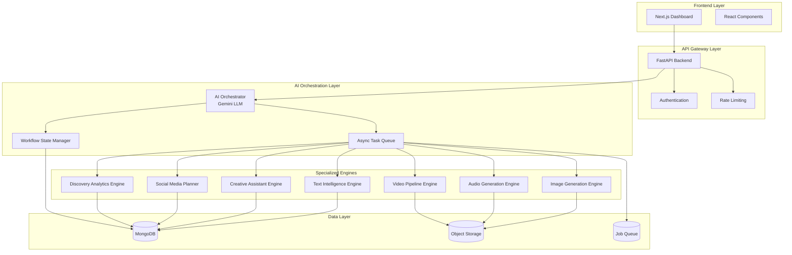

# Design Document: ContentFlow AI

## Overview

ContentFlow AI implements a modular, AI-orchestrated architecture that coordinates specialized engines through a central LLM-powered orchestrator. The system follows the Orchestrator-Worker pattern, where a centralized AI_Orchestrator (using Google Gemini) acts as the reasoning layer to coordinate task distribution among specialized engines. This design prioritizes workflow intelligence, explainability, and cost control while maintaining high scalability through asynchronous processing.

The architecture supports the complete content lifecycle: Discover → Create → Transform → Plan → Publish → Analyze → Improve, with each stage handled by specialized engines coordinated through intelligent orchestration.

## Architecture

### High-Level Architecture



### Orchestration Pattern

The system implements the Orchestrator-Worker pattern with LLM-powered coordination:

1. **Central Orchestrator**: AI_Orchestrator uses Gemini LLM for intelligent task decomposition and routing
2. **Specialized Workers**: Each engine handles specific content types and operations
3. **Async Coordination**: Background job processing with real-time status updates
4. **State Management**: Workflow states tracked through the content lifecycle

## Components and Interfaces

### AI Orchestrator

**Purpose**: Central coordination layer using LLM reasoning to manage complex workflows

**Key Responsibilities**:
- Task decomposition and routing to appropriate engines
- Workflow state management and lifecycle tracking
- Error handling and graceful degradation
- Cost monitoring and usage control

**Interface**:
```python
class AIOrchestrator:
    async def orchestrate_workflow(self, request: WorkflowRequest) -> WorkflowResponse
    async def route_task(self, task: Task) -> Engine
    async def manage_workflow_state(self, content_id: str, state: WorkflowState) -> None
    async def handle_engine_error(self, engine: str, error: Exception) -> ErrorResponse
```

### Text Intelligence Engine

**Purpose**: Handles all text-based operations including generation, transformation, and analysis

**Key Capabilities**:
- Content generation (blogs, captions, scripts)
- Summarization and adaptation
- Tone transformation and translation
- Content parsing and validation

**Interface**:
```python
class TextIntelligenceEngine:
    async def generate_content(self, prompt: str, content_type: ContentType) -> TextContent
    async def summarize_content(self, content: str, target_length: int) -> str
    async def transform_tone(self, content: str, target_tone: str) -> str
    async def translate_content(self, content: str, target_language: str) -> str
    async def parse_content(self, raw_content: str, format: ContentFormat) -> ParsedContent
```

### Creative Assistant Engine

**Purpose**: Provides interactive, iterative creative collaboration

**Key Capabilities**:
- Contextual creative suggestions
- Multi-turn conversation management
- Design and marketing assistance
- Iterative refinement based on feedback

**Interface**:
```python
class CreativeAssistantEngine:
    async def start_creative_session(self, context: CreativeContext) -> SessionId
    async def provide_suggestions(self, session_id: SessionId, request: SuggestionRequest) -> List[Suggestion]
    async def refine_suggestions(self, session_id: SessionId, feedback: Feedback) -> List[Suggestion]
    async def maintain_context(self, session_id: SessionId, interaction: Interaction) -> None
```

### Social Media Planner

**Purpose**: Optimizes content for social media platforms and manages scheduling

**Key Capabilities**:
- Platform-specific optimization
- Hashtag and CTA generation
- Optimal timing suggestions
- Engagement prediction

**Interface**:
```python
class SocialMediaPlanner:
    async def optimize_for_platform(self, content: Content, platform: Platform) -> OptimizedContent
    async def generate_hashtags(self, content: Content) -> List[str]
    async def suggest_posting_times(self, platform: Platform, audience: Audience) -> List[datetime]
    async def predict_engagement(self, content: Content, platform: Platform) -> EngagementScore
```

### Discovery Analytics Engine

**Purpose**: Analyzes content performance and discovers trends

**Key Capabilities**:
- Automatic content tagging
- Trend analysis and discovery
- Engagement analytics
- AI-powered improvement suggestions

**Interface**:
```python
class DiscoveryAnalyticsEngine:
    async def auto_tag_content(self, content: Content) -> List[Tag]
    async def analyze_trends(self, time_period: TimePeriod) -> TrendAnalysis
    async def calculate_engagement_metrics(self, content_id: str) -> EngagementMetrics
    async def generate_improvement_suggestions(self, content: Content, metrics: EngagementMetrics) -> List[Suggestion]
```

## Data Models

### Core Content Model

```python
class ContentItem:
    id: str
    type: ContentType  # TEXT, IMAGE, AUDIO, VIDEO
    title: str
    content: Union[str, bytes]  # Text content or binary data reference
    metadata: ContentMetadata
    workflow_state: WorkflowState
    version: int
    created_at: datetime
    updated_at: datetime
    tags: List[str]
    
class ContentMetadata:
    author: str
    platform_optimizations: Dict[Platform, OptimizationData]
    engagement_metrics: EngagementMetrics
    cost_tracking: CostData
    processing_history: List[ProcessingStep]
```

### Workflow State Model

```python
class WorkflowState(Enum):
    DISCOVER = "discover"
    CREATE = "create"
    TRANSFORM = "transform"
    PLAN = "plan"
    PUBLISH = "publish"
    ANALYZE = "analyze"
    IMPROVE = "improve"

class WorkflowRequest:
    content_id: Optional[str]
    operation: str
    parameters: Dict[str, Any]
    target_engines: List[str]
    priority: int
    user_id: str
```

### Job Processing Model

```python
class AsyncJob:
    id: str
    type: JobType
    status: JobStatus  # QUEUED, RUNNING, COMPLETED, FAILED
    content_id: str
    engine: str
    parameters: Dict[str, Any]
    result: Optional[Any]
    error: Optional[str]
    created_at: datetime
    started_at: Optional[datetime]
    completed_at: Optional[datetime]
    retry_count: int
```

### Cost Tracking Model

```python
class CostData:
    total_tokens_used: int
    cost_per_operation: Dict[str, float]
    total_cost: float
    usage_limits: UsageLimits
    
class UsageLimits:
    daily_token_limit: int
    monthly_cost_limit: float
    per_user_limits: Dict[str, int]
```

Now I need to use the prework tool to analyze the acceptance criteria before writing the Correctness Properties section:

<function_calls>
<invoke name="prework">
<parameter name="featureName">contentflow-ai

## Correctness Properties

*A property is a characteristic or behavior that should hold true across all valid executions of a system—essentially, a formal statement about what the system should do. Properties serve as the bridge between human-readable specifications and machine-verifiable correctness guarantees.*

After analyzing the acceptance criteria, I've identified several key properties that can be consolidated to eliminate redundancy while maintaining comprehensive coverage:

### Property Reflection

Several properties can be combined for more comprehensive testing:
- Content generation properties (1.1-1.4) can be unified into a single content generation property
- Transformation properties (2.1-2.4) can be combined into a comprehensive transformation property  
- Creative assistance properties (3.1-3.4) can be unified around suggestion quality and iteration
- Social media properties (4.1-4.5) can be combined into platform optimization validation
- Analytics properties (5.1-5.4) can be unified around data accuracy and insight generation
- Orchestration properties (6.1-6.5) can be combined into workflow coordination validation
- Job processing properties (7.1-7.5) can be unified around async processing reliability
- Storage properties (8.1-8.5) can be combined into data persistence and versioning validation
- Security properties (9.1-9.5) can be unified around access control and monitoring
- Cost control properties (10.1-10.5) can be combined into usage tracking and enforcement

### Core Properties

**Property 1: Content Generation Consistency**
*For any* content generation request with valid parameters, the appropriate specialized engine should produce content that matches the requested type and contains relevant information based on the provided parameters.
**Validates: Requirements 1.1, 1.2, 1.3, 1.4, 1.5**

**Property 2: Content Transformation Preservation**
*For any* content transformation request, the output should preserve the core meaning and information while successfully adapting to the specified transformation requirements (tone, language, platform, length).
**Validates: Requirements 2.1, 2.2, 2.3, 2.4, 2.5**

**Property 3: Creative Assistance Relevance and Iteration**
*For any* creative assistance session, suggestions should be contextually relevant to the request type, and iterative refinement should incorporate user feedback to improve suggestion quality.
**Validates: Requirements 3.1, 3.2, 3.3, 3.4, 3.5**

**Property 4: Social Media Platform Optimization**
*For any* content optimized for a specific social media platform, the output should meet platform-specific constraints and include relevant hashtags, CTAs, and timing recommendations.
**Validates: Requirements 4.1, 4.2, 4.3, 4.4, 4.5**

**Property 5: Analytics Data Accuracy and Insights**
*For any* content analysis request, the generated tags, metrics, and improvement suggestions should be accurate, relevant, and based on actual content characteristics and performance data.
**Validates: Requirements 5.1, 5.2, 5.3, 5.4, 5.5**

**Property 6: Workflow Orchestration Coordination**
*For any* workflow request, the AI_Orchestrator should route tasks to appropriate engines, manage dependencies correctly, track state transitions, and handle errors gracefully.
**Validates: Requirements 6.1, 6.2, 6.3, 6.4, 6.5**

**Property 7: Asynchronous Job Processing Reliability**
*For any* long-running task, the system should queue it properly, provide accurate status updates, handle completion and failures appropriately, and manage resource allocation efficiently.
**Validates: Requirements 7.1, 7.2, 7.3, 7.4, 7.5**

**Property 8: Content Versioning and Storage Integrity**
*For any* content storage operation, the system should create proper versions with timestamps, maintain data integrity, provide accurate version history, and ensure secure storage of media assets.
**Validates: Requirements 8.1, 8.2, 8.3, 8.4, 8.5**

**Property 9: API Security and Access Control**
*For any* API request, the system should properly authenticate and authorize access, enforce rate limits, detect and respond to suspicious activity, and maintain comprehensive security logs.
**Validates: Requirements 9.1, 9.2, 9.3, 9.4, 9.5**

**Property 10: Cost Tracking and Usage Enforcement**
*For any* AI operation, the system should accurately track token usage and costs, provide warnings when approaching limits, enforce usage caps, and generate detailed usage analytics.
**Validates: Requirements 10.1, 10.2, 10.3, 10.4, 10.5**

**Property 11: Content Parsing Round-Trip Consistency**
*For any* valid content object, parsing then formatting then parsing should produce an equivalent object, ensuring parser and formatter are proper inverses.
**Validates: Requirements 11.5**

**Property 12: Data Serialization Round-Trip Consistency**
*For any* valid system object, serializing then deserializing should produce an equivalent object, ensuring serialization and deserialization are proper inverses.
**Validates: Requirements 12.5**

**Property 13: Input Validation and Error Handling**
*For any* invalid input or error condition, the system should provide descriptive error messages, reject invalid data appropriately, and maintain system stability.
**Validates: Requirements 11.2, 11.3, 12.3**

## Error Handling

### Error Categories and Responses

**Engine-Level Errors**:
- AI service timeouts or failures
- Content generation quality issues
- Resource exhaustion

**Orchestration Errors**:
- Workflow routing failures
- Engine coordination issues
- State management inconsistencies

**Data Errors**:
- Parsing and validation failures
- Storage and retrieval issues
- Serialization problems

**Security Errors**:
- Authentication failures
- Authorization violations
- Rate limit exceeded

### Error Handling Strategy

1. **Graceful Degradation**: System continues operating with reduced functionality when non-critical engines fail
2. **Retry Logic**: Exponential backoff for transient failures with configurable retry limits
3. **Circuit Breaker**: Prevent cascade failures by temporarily disabling failing engines
4. **Error Propagation**: Clear error messages propagated to users with actionable guidance
5. **Logging and Monitoring**: Comprehensive error logging for debugging and system health monitoring

## Testing Strategy

### Dual Testing Approach

The system requires both unit testing and property-based testing for comprehensive coverage:

**Unit Tests**:
- Specific examples demonstrating correct behavior
- Edge cases and error conditions
- Integration points between components
- Mock external dependencies for isolated testing

**Property-Based Tests**:
- Universal properties verified across randomized inputs
- Minimum 100 iterations per property test
- Each test tagged with feature and property reference
- Comprehensive input coverage through intelligent generation

### Property-Based Testing Configuration

**Testing Framework**: Use Hypothesis (Python) for property-based testing
**Test Configuration**:
- Minimum 100 iterations per property test
- Custom generators for content types, workflow states, and user inputs
- Shrinking enabled for minimal failing examples
- Timeout configuration for long-running AI operations

**Test Tagging Format**:
```python
@given(content_request=content_generation_strategy())
def test_content_generation_consistency(content_request):
    """Feature: contentflow-ai, Property 1: Content Generation Consistency"""
    # Test implementation
```

### Integration Testing

**API Integration**:
- End-to-end workflow testing
- External AI service integration validation
- Database and storage integration verification

**Performance Testing**:
- Load testing for concurrent users
- Stress testing for resource limits
- Latency testing for real-time features

**Security Testing**:
- Authentication and authorization validation
- Rate limiting effectiveness
- Input sanitization and validation