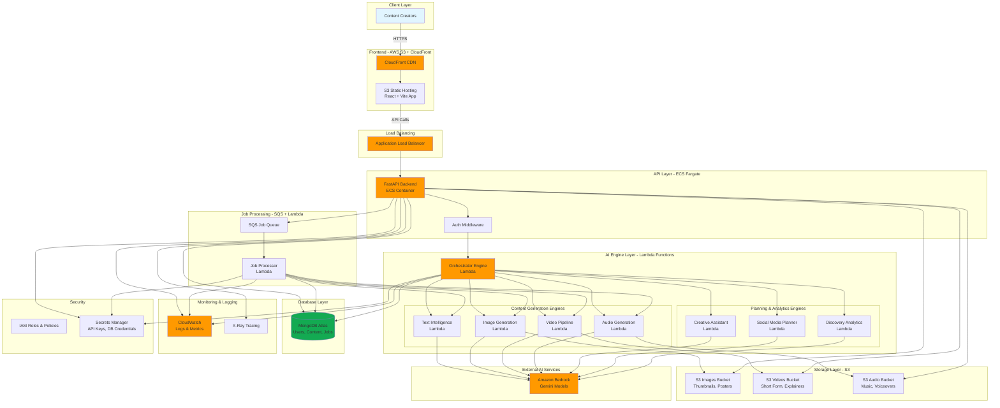

# ContentFlow AI - AWS Architecture Diagram

## System Architecture Overview

## Detailed Component Breakdown

### 1. Frontend Layer
- **CloudFront**: Global CDN for low-latency content delivery
- **S3 Static Hosting**: Hosts React application built with Vite
- **Technology**: React, TypeScript, TailwindCSS

### 2. API Layer (ECS Fargate)
- **FastAPI Backend**: RESTful API server
- **Auto-scaling**: Based on CPU/memory metrics
- **Health Checks**: ALB monitors container health
- **Endpoints**:
  - `/api/v1/auth` - Authentication
  - `/api/v1/content` - Content management
  - `/api/v1/engines` - AI engine access
  - `/api/v1/jobs` - Job management
  - `/api/v1/orchestrator` - Orchestration

### 3. AI Engine Layer (Lambda)
**Orchestrator Engine**:
- Coordinates multiple AI engines
- Manages complex workflows
- Handles engine dependencies

**Content Generation Engines**:
- Text Intelligence: Content analysis, SEO, sentiment
- Image Generation: Thumbnails, posters, graphics
- Video Pipeline: Short-form videos, explainers
- Audio Generation: Music, voiceovers, narrations

**Planning & Analytics**:
- Creative Assistant: Content ideation
- Social Media Planner: Scheduling, optimization
- Discovery Analytics: Trend analysis, insights

### 4. Job Processing System
- **SQS Queue**: Decouples API from long-running tasks
- **Job Processor Lambda**: Executes async jobs
- **Benefits**: Scalability, reliability, retry logic

### 5. Database (MongoDB Atlas)
**Collections**:
- `users`: User accounts and profiles
- `content`: Generated content metadata
- `jobs`: Job status and history
- `engagement`: Analytics and metrics

### 6. Storage (S3)
**Buckets**:
- `images/`: Thumbnails, posters, graphics
- `videos/`: Short-form content, explainers
- `audio/`: Music, voiceovers, narrations
- **Lifecycle Policies**: Auto-archive old content
- **Versioning**: Enabled for content recovery

### 7. External Services
- **Amazon Bedrock**: Gemini AI models for generation
- **API Integration**: Secure, rate-limited access

### 8. Monitoring & Observability
- **CloudWatch Logs**: Centralized logging
- **CloudWatch Metrics**: Performance monitoring
- **X-Ray**: Distributed tracing
- **Alarms**: Automated alerts for issues

### 9. Security
- **IAM Roles**: Least-privilege access
- **Secrets Manager**: Secure credential storage
- **VPC**: Network isolation
- **Security Groups**: Firewall rules
- **JWT Authentication**: Secure API access

## Data Flow Examples

### Content Generation Flow
1. User submits request via React frontend
2. CloudFront routes to S3 static site
3. Frontend calls API through ALB
4. API authenticates user (JWT)
5. API creates job in SQS queue
6. Job Processor Lambda picks up job
7. Processor invokes appropriate AI engine
8. Engine calls Bedrock for AI generation
9. Generated content saved to S3
10. Metadata stored in MongoDB
11. User notified of completion

### Orchestrated Workflow
1. User requests complex content (e.g., video with thumbnail)
2. API calls Orchestrator Lambda
3. Orchestrator coordinates:
   - Video Engine generates video
   - Image Engine creates thumbnail
   - Text Engine writes description
4. All engines use Bedrock
5. Results aggregated and stored
6. User receives complete package

## Scalability Features

- **Auto-scaling**: ECS tasks scale based on load
- **Lambda Concurrency**: Handles burst traffic
- **SQS Buffering**: Smooths traffic spikes
- **CloudFront Caching**: Reduces origin load
- **MongoDB Sharding**: Horizontal database scaling

## Cost Optimization

- **Lambda**: Pay per execution
- **ECS Fargate**: Pay for actual usage
- **S3 Lifecycle**: Move old content to Glacier
- **CloudFront**: Reduce origin requests
- **Reserved Capacity**: For predictable workloads

## Disaster Recovery

- **Multi-AZ**: High availability
- **S3 Versioning**: Content recovery
- **MongoDB Backups**: Point-in-time recovery
- **CloudWatch Alarms**: Proactive monitoring
- **Auto-healing**: ECS replaces failed containers

## Deployment Strategy

1. **Infrastructure as Code**: Terraform/CloudFormation
2. **CI/CD Pipeline**: GitHub Actions → ECR → ECS
3. **Blue-Green Deployment**: Zero-downtime updates
4. **Rollback**: Quick revert on issues
5. **Environment Separation**: Dev, Staging, Production
