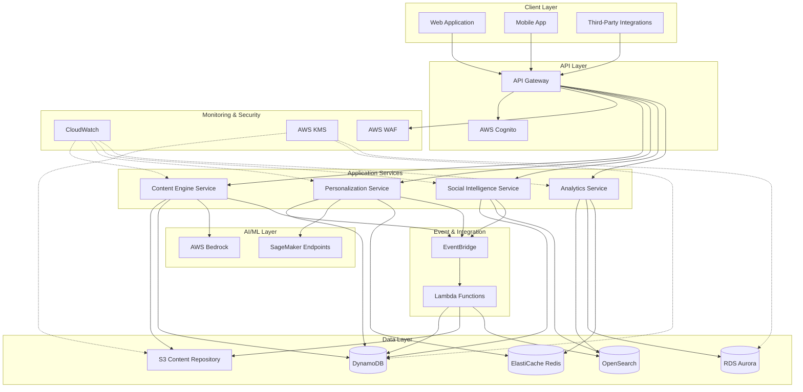

# Design Document: Content Intelligence Platform

## Overview

The Content Intelligence Platform is a cloud-native, microservices-based system built on AWS infrastructure that provides AI-driven content creation, management, personalization, and analytics capabilities. The platform follows event-driven architecture principles to ensure scalability, resilience, and loose coupling between components.

### Key Design Principles

1. **Microservices Architecture**: Each major capability (content generation, personalization, analytics) is implemented as an independent service
2. **Event-Driven Communication**: Services communicate asynchronously through AWS EventBridge for loose coupling
3. **API-First Design**: All functionality exposed through well-documented REST APIs
4. **Serverless-First**: Leverage AWS Lambda and managed services to minimize operational overhead
5. **Security by Design**: Encryption, authentication, and authorization built into every layer
6. **Observability**: Comprehensive logging, metrics, and tracing for all operations
7. **Cost Optimization**: Use of spot instances, auto-scaling, and lifecycle policies to control costs

### Technology Stack

- **Compute**: AWS Lambda (serverless functions), ECS Fargate (containerized services)
- **API Layer**: AWS API Gateway with REST APIs
- **Storage**: S3 (content storage), DynamoDB (metadata, user data), RDS Aurora (relational data)
- **AI/ML**: AWS SageMaker (model hosting), Bedrock (foundation models for content generation)
- **Authentication**: AWS Cognito (user management, JWT tokens)
- **Event Bus**: AWS EventBridge (event routing)
- **CDN**: CloudFront (content delivery)
- **Monitoring**: CloudWatch (logs, metrics, alarms)
- **Caching**: ElastiCache Redis (API responses, session data)
- **Search**: OpenSearch (content search and analytics)

## Architecture

### High-Level Architecture



### Service Interaction Flow

**Content Creation Flow:**
1. User submits content generation request via API Gateway
2. API Gateway validates JWT token with Cognito
3. Content Engine Service receives request
4. Content Engine calls AWS Bedrock for AI generation
5. Generated content stored in S3 with metadata in DynamoDB
6. ContentCreated event published to EventBridge
7. Lambda functions trigger for tagging, indexing in OpenSearch
8. Response returned to user with content ID

**Personalization Flow:**
1. User requests personalized content feed
2. Personalization Service retrieves user segment from DynamoDB
3. Service checks Redis cache for recent recommendations
4. If cache miss, queries OpenSearch for relevant content
5. SageMaker endpoint scores content for relevance
6. Results cached in Redis and returned to user

**Analytics Flow:**
1. Engagement events stream to EventBridge
2. Lambda functions aggregate events into OpenSearch
3. Analytics Service queries OpenSearch for metrics
4. Complex analytics computed and cached in Redis
5. Dashboard queries Analytics Service API
6. Real-time metrics displayed with <5 minute latency

## Components and Interfaces

### 1. Content Engine Service

**Responsibility**: AI-powered content generation, transformation, and validation

**Key Operations:**
- `generateContent(topic, format, style, parameters)`: Generate new content
- `transformContent(sourceContent, targetFormat)`: Repurpose existing content
- `validateContent(content, format)`: Validate content structure
- `prettyPrintContent(content, format)`: Format content according to style guide

**Technology**: 
- Runtime: Node.js 20 on AWS Lambda
- AI Models: AWS Bedrock (Claude 3.5 for generation)
- Storage: S3 for content, DynamoDB for metadata

**API Endpoints:**
```
POST /v1/content/generate
POST /v1/content/transform
POST /v1/content/validate
GET /v1/content/{contentId}
PUT /v1/content/{contentId}
DELETE /v1/content/{contentId}
```

**Data Models:**
```typescript
interface ContentGenerationRequest {
  topic: string;
  format: ContentFormat; // 'blog' | 'social' | 'marketing' | 'email' | 'video_script'
  style: WritingStyle; // 'professional' | 'casual' | 'technical' | 'creative'
  parameters: {
    length?: number;
    targetAudience?: string;
    keywords?: string[];
    tone?: string;
  };
}

interface ContentItem {
  id: string;
  content: string;
  format: ContentFormat;
  style: WritingStyle;
  metadata: {
    createdAt: string; // ISO 8601
    updatedAt: string;
    version: number;
    tags: string[];
    generationParams: Record<string, any>;
  };
  status: 'draft' | 'published' | 'archived';
}
```

**Event Publications:**
- `ContentCreated`: When new content is generated
- `ContentUpdated`: When content is modified
- `ContentDeleted`: When content is removed
- `ContentPublished`: When content status changes to published

### 2. Personalization Service

**Responsibility**: Audience segmentation, content tagging, and personalized recommendations

**Key Operations:**
- `tagContent(contentId)`: Automatically tag and categorize content
- `createSegment(criteria)`: Define new audience segment
- `updateSegmentMembership()`: Recalculate segment membership
- `getPersonalizedFeed(userId, limit)`: Retrieve personalized content
- `predictEngagement(contentId, segmentId)`: Predict content performance

**Technology**:
- Runtime: Python 3.11 on ECS Fargate (long-running service)
- ML Models: Custom models on SageMaker (content classification, engagement prediction)
- Storage: DynamoDB for segments and user profiles, Redis for caching

**API Endpoints:**
```
POST /v1/content/{contentId}/tag
POST /v1/segments
GET /v1/segments/{segmentId}
PUT /v1/segments/{segmentId}
GET /v1/users/{userId}/feed
POST /v1/predictions/engagement
```

**Data Models:**
```typescript
interface AudienceSegment {
  id: string;
  name: string;
  criteria: {
    demographics?: Record<string, any>;
    behaviors?: string[];
    interests?: string[];
    engagementLevel?: 'low' | 'medium' | 'high';
  };
  memberCount: number;
  lastUpdated: string;
}

interface ContentTags {
  contentId: string;
  topics: string[];
  sentiment: 'positive' | 'neutral' | 'negative';
  targetAudience: string[];
  confidence: number; // 0-1
  extractedAt: string;
}

interface EngagementPrediction {
  contentId: string;
  segmentId: string;
  score: number; // 0-100
  confidence: number; // 0-1
  factors: Array<{
    name: string;
    impact: number;
    explanation: string;
  }>;
}
```

**Event Publications:**
- `ContentTagged`: When content tagging completes
- `SegmentCreated`: When new segment is defined
- `SegmentUpdated`: When segment membership changes
- `PredictionCompleted`: When engagement prediction finishes

### 3. Social Intelligence Service

**Responsibility**: Social media planning, trend analysis, and engagement optimization

**Key Operations:**
- `schedulePost(contentId, platform, scheduledTime)`: Schedule social media post
- `analyzeTrends()`: Identify trending topics
- `identifyContentGaps()`: Find opportunities in content coverage
- `optimizeEngagement(contentId)`: Provide optimization recommendations
- `publishScheduledPosts()`: Execute scheduled publications

**Technology**:
- Runtime: Python 3.11 on ECS Fargate
- External APIs: Social media platform APIs (Twitter, LinkedIn, Facebook, Instagram, TikTok)
- Storage: DynamoDB for schedules, OpenSearch for trend data

**API Endpoints:**
```
POST /v1/social/schedule
GET /v1/social/schedule
DELETE /v1/social/schedule/{scheduleId}
GET /v1/social/trends
GET /v1/social/content-gaps
POST /v1/social/optimize
```

**Data Models:**
```typescript
interface ScheduledPost {
  id: string;
  contentId: string;
  platform: 'twitter' | 'linkedin' | 'facebook' | 'instagram' | 'tiktok';
  scheduledTime: string; // ISO 8601
  status: 'pending' | 'published' | 'failed';
  optimizations: {
    hashtags: string[];
    postingTime: string;
    callToAction: string;
  };
}

interface Trend {
  id: string;
  topic: string;
  momentum: number; // 0-100
  platforms: string[];
  detectedAt: string;
  relatedKeywords: string[];
  opportunityScore: number; // 0-100
}

interface ContentGap {
  topic: string;
  opportunityScore: number;
  competitionLevel: 'low' | 'medium' | 'high';
  suggestedFormats: ContentFormat[];
  reasoning: string;
}
```

**Event Publications:**
- `PostScheduled`: When post is scheduled
- `PostPublished`: When post is published to platform
- `TrendDetected`: When new trend is identified
- `ContentGapIdentified`: When gap analysis completes

### 4. Analytics Service

**Responsibility**: Real-time metrics, performance analytics, and ROI tracking

**Key Operations:**
- `recordEngagement(contentId, eventType, metadata)`: Record engagement event
- `getRealtimeMetrics(filters)`: Retrieve current metrics
- `getPerformanceAnalytics(contentId, dateRange)`: Analyze content performance
- `calculateROI(contentId, dateRange)`: Compute return on investment
- `generateReport(reportType, filters)`: Create analytics report

**Technology**:
- Runtime: Python 3.11 on ECS Fargate
- Storage: OpenSearch for time-series data, RDS Aurora for aggregated analytics
- Caching: Redis for frequently accessed metrics

**API Endpoints:**
```
POST /v1/analytics/events
GET /v1/analytics/realtime
GET /v1/analytics/content/{contentId}/performance
GET /v1/analytics/roi
POST /v1/analytics/reports
```

**Data Models:**
```typescript
interface EngagementEvent {
  eventId: string;
  contentId: string;
  userId?: string;
  eventType: 'view' | 'click' | 'share' | 'comment' | 'conversion';
  timestamp: string; // ISO 8601
  metadata: {
    platform?: string;
    source?: string;
    deviceType?: string;
    location?: string;
  };
}

interface PerformanceMetrics {
  contentId: string;
  dateRange: {
    start: string;
    end: string;
  };
  metrics: {
    views: number;
    clicks: number;
    shares: number;
    comments: number;
    conversions: number;
    engagementRate: number;
    conversionRate: number;
    reach: number;
    bounceRate: number;
  };
  trends: {
    metric: string;
    change: number; // percentage
    direction: 'up' | 'down' | 'stable';
  }[];
}

interface ROIMetrics {
  contentId: string;
  costs: {
    generation: number;
    storage: number;
    distribution: number;
    total: number;
  };
  revenue: {
    attributed: number;
    attributionModel: 'last-touch' | 'multi-touch';
  };
  roi: number; // percentage
  costPerEngagement: number;
  costPerConversion: number;
  confidence: number; // 0-1
}
```

**Event Subscriptions:**
- Listens to all content lifecycle events for analytics aggregation

### 5. API Gateway Configuration

**Responsibility**: Request routing, authentication, rate limiting, and API documentation

**Configuration:**
- **Authentication**: JWT validation via Cognito authorizer
- **Rate Limiting**: 
  - Standard tier: 1000 requests/hour per user
  - Premium tier: 10000 requests/hour per user
- **CORS**: Configured for web application domains
- **Request Validation**: JSON schema validation for all POST/PUT requests
- **Response Transformation**: Standardized error format

**Standard Error Response:**
```typescript
interface ErrorResponse {
  error: {
    code: string;
    message: string;
    details?: Record<string, any>;
    requestId: string;
    timestamp: string;
  };
}
```

**Rate Limit Headers:**
```
X-RateLimit-Limit: 1000
X-RateLimit-Remaining: 847
X-RateLimit-Reset: 1640995200
```

### 6. Event-Driven Integration

**EventBridge Configuration:**

**Event Bus**: `content-intelligence-platform`

**Event Patterns:**
```json
{
  "source": ["content.engine", "personalization.service", "social.intelligence", "analytics.service"],
  "detail-type": [
    "ContentCreated",
    "ContentUpdated", 
    "ContentDeleted",
    "ContentPublished",
    "ContentTagged",
    "SegmentUpdated",
    "TrendDetected",
    "PostPublished"
  ]
}
```

**Lambda Event Processors:**
1. **Content Indexer**: Indexes new content in OpenSearch
2. **Tag Processor**: Triggers ML tagging when content is created
3. **Notification Handler**: Sends notifications for important events
4. **Analytics Aggregator**: Aggregates engagement events
5. **Segment Updater**: Updates segment membership on schedule

## Data Models

### Content Storage Schema (S3 + DynamoDB)

**S3 Structure:**
```
s3://content-intelligence-platform-{env}/
  ├── content/
  │   ├── {contentId}/
  │   │   ├── v1.json
  │   │   ├── v2.json
  │   │   └── current.json
  ├── exports/
  │   └── reports/
  └── backups/
```

**DynamoDB Tables:**

**Table: ContentMetadata**
- Partition Key: `contentId` (String)
- Sort Key: `version` (Number)
- GSI: `status-createdAt-index` for querying by status
- GSI: `format-createdAt-index` for querying by format
- Attributes: format, style, tags, createdAt, updatedAt, status, s3Key

**Table: UserProfiles**
- Partition Key: `userId` (String)
- Attributes: segments, preferences, engagementHistory, createdAt, lastActive

**Table: AudienceSegments**
- Partition Key: `segmentId` (String)
- Attributes: name, criteria, memberCount, lastUpdated, createdBy

**Table: ScheduledPosts**
- Partition Key: `scheduleId` (String)
- GSI: `scheduledTime-index` for time-based queries
- Attributes: contentId, platform, scheduledTime, status, optimizations

### Analytics Schema (OpenSearch + RDS)

**OpenSearch Indices:**

**Index: engagement-events-{YYYY-MM}**
```json
{
  "mappings": {
    "properties": {
      "eventId": { "type": "keyword" },
      "contentId": { "type": "keyword" },
      "userId": { "type": "keyword" },
      "eventType": { "type": "keyword" },
      "timestamp": { "type": "date" },
      "platform": { "type": "keyword" },
      "metadata": { "type": "object" }
    }
  }
}
```

**Index: trends-{YYYY-MM}**
```json
{
  "mappings": {
    "properties": {
      "trendId": { "type": "keyword" },
      "topic": { "type": "text" },
      "momentum": { "type": "float" },
      "detectedAt": { "type": "date" },
      "keywords": { "type": "keyword" }
    }
  }
}
```

**RDS Aurora Schema:**

**Table: content_performance**
```sql
CREATE TABLE content_performance (
  content_id VARCHAR(255) PRIMARY KEY,
  total_views BIGINT DEFAULT 0,
  total_clicks BIGINT DEFAULT 0,
  total_shares BIGINT DEFAULT 0,
  total_comments BIGINT DEFAULT 0,
  total_conversions BIGINT DEFAULT 0,
  engagement_rate DECIMAL(5,2),
  conversion_rate DECIMAL(5,2),
  last_updated TIMESTAMP DEFAULT CURRENT_TIMESTAMP,
  INDEX idx_engagement_rate (engagement_rate DESC),
  INDEX idx_conversion_rate (conversion_rate DESC)
);
```

**Table: roi_tracking**
```sql
CREATE TABLE roi_tracking (
  content_id VARCHAR(255) PRIMARY KEY,
  generation_cost DECIMAL(10,2),
  storage_cost DECIMAL(10,2),
  distribution_cost DECIMAL(10,2),
  total_cost DECIMAL(10,2),
  attributed_revenue DECIMAL(10,2),
  attribution_model VARCHAR(50),
  roi_percentage DECIMAL(10,2),
  calculated_at TIMESTAMP DEFAULT CURRENT_TIMESTAMP,
  FOREIGN KEY (content_id) REFERENCES content_performance(content_id)
);
```

### Caching Strategy (Redis)

**Cache Keys:**
- `user:{userId}:feed` - TTL: 5 minutes
- `content:{contentId}:tags` - TTL: 1 hour
- `segment:{segmentId}:members` - TTL: 15 minutes
- `analytics:realtime:{metric}` - TTL: 1 minute
- `predictions:{contentId}:{segmentId}` - TTL: 30 minutes

**Cache Invalidation:**
- Content updates invalidate related cache keys
- Segment updates invalidate member caches
- Event-driven invalidation via EventBridge


## Correctness Properties

A property is a characteristic or behavior that should hold true across all valid executions of a system—essentially, a formal statement about what the system should do. Properties serve as the bridge between human-readable specifications and machine-verifiable correctness guarantees.

### Property Reflection

After analyzing all acceptance criteria, I identified the following redundancies and consolidations:

**Redundancies Eliminated:**
- Properties 2.1 and 2.2 (storage and retrieval performance) can be combined into a single storage round-trip property
- Properties 24.1, 24.3, and 24.4 all relate to parsing/printing and are consolidated into the explicit round-trip property 24.4
- Properties 1.1 and 1.6 (generation with metadata) can be combined since metadata is part of generation
- Properties 11.1, 11.2, and 11.3 (various analytics calculations) can be consolidated into comprehensive analytics properties

**Properties Consolidated:**
- Content validation properties (24.2 and 24.5) combined into comprehensive validation property
- Authentication properties (14.1, 14.5, 14.6) consolidated into authentication flow property
- Encryption properties (15.1, 15.2, 15.3) consolidated into comprehensive encryption property

### Content Engine Properties

**Property 1: Content Generation Completeness**
*For any* valid content generation request (topic, format, style, parameters), the Content_Engine should generate content that includes all required metadata fields (contentId, format, style, createdAt, generationParams) and matches the requested format specification.
**Validates: Requirements 1.1, 1.6**

**Property 2: Error Handling for Invalid Input**
*For any* invalid content generation request (missing required fields, unsupported format, malformed parameters), the Content_Engine should return an error response with a descriptive message and appropriate error code within the timeout threshold.
**Validates: Requirements 1.3**

**Property 3: Content Parsing Round Trip**
*For any* valid content object, parsing the content, then pretty-printing it, then parsing again should produce an equivalent content object with the same semantic meaning.
**Validates: Requirements 24.1, 24.3, 24.4**

**Property 4: Content Validation**
*For any* content submission, if the content violates format-specific constraints (length limits, required fields, format grammar), the Content_Engine should reject it with specific error messages indicating the violation location and reason.
**Validates: Requirements 24.2, 24.5**


### Content Repository Properties

**Property 5: Storage and Retrieval Round Trip**
*For any* content item, storing it to the repository and then retrieving it by ID should return an equivalent content item with the same content, metadata, and format.
**Validates: Requirements 2.1, 2.2**

**Property 6: Encryption at Rest**
*For any* content stored in S3, the raw stored data should be encrypted using AES-256, and decryption should only be possible with valid KMS keys.
**Validates: Requirements 2.3, 15.1**

**Property 7: Retry Logic**
*For any* storage operation that fails transiently, the Content_Repository should retry up to 3 times with exponential backoff before returning a failure, and the retry count should be logged.
**Validates: Requirements 2.4**

**Property 8: Version Management**
*For any* content item with multiple updates, the Content_Repository should maintain at least the 10 most recent versions, and retrieving a specific version should return the exact content from that version.
**Validates: Requirements 2.5**

**Property 9: Soft Delete**
*For any* content item that is deleted, it should remain in a soft-deleted state (retrievable by administrators) for 30 days before permanent removal, and regular queries should not return soft-deleted items.
**Validates: Requirements 2.6**

### Personalization Service Properties

**Property 10: Content Tagging Completeness**
*For any* content item processed for tagging, the Personalization_Service should assign tags in at least three categories (topic, sentiment, target audience) with confidence scores, completing within the performance threshold.
**Validates: Requirements 3.1, 3.2**

**Property 11: Low Confidence Flagging**
*For any* content tagging result where the overall confidence score is below 70%, the content should be flagged for manual review with the flag persisted in metadata.
**Validates: Requirements 3.3**

**Property 12: Tag Vocabulary Consistency**
*For any* content item, all assigned tags should exist in the controlled vocabulary, and attempting to assign tags outside the vocabulary should either map to valid tags or be rejected.
**Validates: Requirements 3.4**

**Property 13: Tag Search Completeness**
*For any* tag search query, all content items matching the tags should be returned, ranked by relevance score, with no false negatives (missing matching items).
**Validates: Requirements 3.5**


**Property 14: Segment Profile Updates**
*For any* user interaction event, the Personalization_Service should update the relevant Audience_Segment profiles within the specified time window, and subsequent queries should reflect the updated data.
**Validates: Requirements 4.1**

**Property 15: Segment Validation**
*For any* new Audience_Segment creation request, if the segment criteria are empty or contain non-measurable conditions, the request should be rejected with a descriptive validation error.
**Validates: Requirements 4.3**

**Property 16: Segment Query Performance**
*For any* Audience_Segment query, the response should include current member count and key characteristics, completing within the performance threshold.
**Validates: Requirements 4.5**

**Property 17: Personalized Content Matching**
*For any* user requesting personalized content, all returned content items should match at least one preference criterion from the user's Audience_Segment profile.
**Validates: Requirements 5.1**

**Property 18: Content Ranking Consistency**
*For any* personalized content feed, items should be ranked by relevance score (combining recency, engagement history, predicted interest), and the ranking should be deterministic for the same input state.
**Validates: Requirements 5.2**

**Property 19: Fallback Content**
*For any* user with insufficient personalized content (fewer than requested items), the feed should be supplemented with trending content from the user's primary interest categories up to the requested limit.
**Validates: Requirements 5.3**

**Property 20: Content Delivery Performance**
*For any* content delivery request, the response should be returned within 500 milliseconds, measured from request receipt to response transmission.
**Validates: Requirements 5.4**

### ML Model Properties

**Property 21: Prediction Score Bounds**
*For any* content item submitted for engagement prediction, the ML_Model should return a score between 0 and 100 (inclusive) with a confidence value between 0 and 1, completing within the performance threshold.
**Validates: Requirements 6.1**

**Property 22: Low Confidence Handling**
*For any* prediction with confidence below 60%, the ML_Model should indicate insufficient data and suggest at least one similar content item for comparison.
**Validates: Requirements 6.3**

**Property 23: Prediction Explainability**
*For any* engagement prediction, the response should include explanations for the top three factors influencing the score, with each factor having a name, impact value, and description.
**Validates: Requirements 6.5**


### Social Intelligence Properties

**Property 24: Schedule Validation**
*For any* content schedule creation request, if the posting time does not align with audience activity patterns for the target segment, the request should be rejected with suggested alternative times.
**Validates: Requirements 7.1**

**Property 25: Schedule Conflict Resolution**
*For any* scheduled post that conflicts with an existing post (same platform, overlapping time window), the Social_Intelligence_Module should suggest at least one alternative time within 30 minutes of the original.
**Validates: Requirements 7.3**

**Property 26: Schedule Time Bounds**
*For any* scheduling request with a date more than 90 days in the future, the request should be rejected with an error indicating the maximum scheduling window.
**Validates: Requirements 7.4**

**Property 27: Optimization Recommendations**
*For any* content item analyzed for optimization, the Social_Intelligence_Module should provide at least three actionable recommendations (e.g., hashtags, posting time, call-to-action) with expected impact estimates.
**Validates: Requirements 8.1, 8.5**

**Property 28: Optimal Posting Time Recommendations**
*For any* content item and target Audience_Segment, the recommended posting times should be based on historical engagement data for that segment, ranked by expected engagement.
**Validates: Requirements 8.2**

**Property 29: Underperformance Analysis**
*For any* content item that underperforms its prediction by more than 20%, the Social_Intelligence_Module should identify at least one potential cause and suggest at least one improvement.
**Validates: Requirements 8.3**

**Property 30: Engagement-Driven Recommendations**
*For any* content optimization request, recommended hashtags, keywords, and call-to-action phrases should be selected from those that historically drove above-average engagement for similar content.
**Validates: Requirements 8.4**

**Property 31: Content Gap Identification**
*For any* trend analysis, identified content gaps should represent topics that are trending but have low coverage in the Content_Repository, with opportunity scores calculated from trend momentum and competition level.
**Validates: Requirements 9.3**

**Property 32: Opportunity Scoring**
*For any* identified content gap, the opportunity score should be calculated using both trend momentum (0-100) and competition level (low/medium/high), with higher momentum and lower competition yielding higher scores.
**Validates: Requirements 9.4**

**Property 33: Trend History Maintenance**
*For any* trend query, the system should provide access to at least 30 days of historical trend data for comparative analysis.
**Validates: Requirements 9.5**


### Analytics Dashboard Properties

**Property 34: Metrics Freshness**
*For any* Analytics_Dashboard access, all displayed metrics should have timestamps within the last 5 minutes, indicating data freshness.
**Validates: Requirements 10.1**

**Property 35: Filter Performance**
*For any* date range filter applied to metrics, the visualizations should update within 3 seconds, and the filtered data should match the specified date range exactly.
**Validates: Requirements 10.3**

**Property 36: Drill-Down Navigation**
*For any* aggregate metric displayed, users should be able to drill down to individual Content_Item performance, and the sum of individual metrics should equal the aggregate (within rounding tolerance).
**Validates: Requirements 10.4**

**Property 37: Anomaly Detection**
*For any* metric value that exceeds 2 standard deviations from its baseline, the Analytics_Dashboard should highlight it with a visual indicator and provide context about the baseline.
**Validates: Requirements 10.5**

**Property 38: Performance Metrics Calculation**
*For any* Content_Item, the Analytics_Dashboard should calculate total engagement (sum of views, clicks, shares, comments), engagement rate (engagement/reach), conversion rate (conversions/views), and ROI, with all calculations mathematically correct.
**Validates: Requirements 11.1**

**Property 39: Metrics Normalization**
*For any* content performance comparison, metrics should be normalized by audience size and time period, allowing fair comparison between content with different reach and publication dates.
**Validates: Requirements 11.2**

**Property 40: Top Performer Identification**
*For any* query for top-performing content filtered by Audience_Segment, format, or topic, the results should be ranked by the specified performance metric in descending order.
**Validates: Requirements 11.3**

**Property 41: Report Generation**
*For any* performance report request, the Analytics_Dashboard should generate a report in the requested format (PDF or CSV) within 30 seconds, containing all requested metrics and filters.
**Validates: Requirements 11.4**

**Property 42: Lifecycle Tracking**
*For any* Content_Item, the Analytics_Dashboard should track metrics across its entire lifecycle (creation, publication, peak engagement, decay), with timestamps for each lifecycle stage.
**Validates: Requirements 11.5**


**Property 43: Revenue Attribution**
*For any* Content_Item that generates conversions, revenue should be attributed using both last-touch and multi-touch models, and the sum of attributed revenue across all content should not exceed total platform revenue.
**Validates: Requirements 12.1**

**Property 44: Cost Calculation**
*For any* Content_Item, total production cost should equal the sum of AI generation costs, storage costs, and distribution costs, with each component calculated from actual resource usage.
**Validates: Requirements 12.2**

**Property 45: ROI Metrics Completeness**
*For any* ROI report, it should include cost per engagement (total cost / total engagements), cost per conversion (total cost / total conversions), and return on ad spend (revenue / ad spend), with all metrics calculated correctly.
**Validates: Requirements 12.3**

**Property 46: Custom ROI Formulas**
*For any* administrator-defined custom ROI formula, the Analytics_Dashboard should evaluate it correctly using the specified variables and operators, and handle division by zero gracefully.
**Validates: Requirements 12.4**

**Property 47: ROI Export Completeness**
*For any* ROI data export, the output should include confidence intervals for revenue attribution and data quality indicators (completeness, accuracy scores) for all metrics.
**Validates: Requirements 12.5**

### API Gateway Properties

**Property 48: Authentication Validation**
*For any* API request with an invalid or expired authentication token, the API_Gateway should return HTTP 401 with a descriptive error message and not process the request.
**Validates: Requirements 13.2**

**Property 49: Rate Limiting Enforcement**
*For any* user making API requests, once they exceed 1000 requests per hour (standard tier), subsequent requests should return HTTP 429 with rate limit headers indicating when the limit resets.
**Validates: Requirements 13.3**

**Property 50: Error Response Format**
*For any* API request that fails (validation error, server error, not found), the response should be in JSON format with a standardized error structure including code, message, requestId, and timestamp.
**Validates: Requirements 13.4**

**Property 51: Pagination Consistency**
*For any* paginated list endpoint, requesting all pages sequentially should return all items exactly once (no duplicates, no missing items), and page sizes should respect the requested limit up to 100 items.
**Validates: Requirements 13.6**


### Authentication and Security Properties

**Property 52: Authentication Flow**
*For any* valid login attempt, the Authentication_Service should return a JWT token valid for 1 hour, and the token should contain user ID, roles, and expiration time, verifiable with the Cognito public key.
**Validates: Requirements 14.1**

**Property 53: Authorization Enforcement**
*For any* user attempting an action not permitted by their role, the Authentication_Service should deny access with HTTP 403, log the attempt with user ID and attempted action, and not execute the action.
**Validates: Requirements 14.4**

**Property 54: Password Policy Enforcement**
*For any* password creation or update, if the password does not meet requirements (minimum 12 characters, uppercase, lowercase, numbers, special characters), the request should be rejected with specific feedback about which requirements are not met.
**Validates: Requirements 14.5**

**Property 55: Token Refresh**
*For any* expired access token with a valid refresh token (not older than 7 days), the Authentication_Service should issue a new access token valid for 1 hour without requiring re-authentication.
**Validates: Requirements 14.6**

**Property 56: Comprehensive Encryption**
*For any* data stored in S3, DynamoDB, or RDS, the data should be encrypted at rest using AES-256, and for any data transmitted over the network, TLS 1.3 or higher should be used.
**Validates: Requirements 15.1, 15.2**

**Property 57: Password Hashing**
*For any* stored user password, it should be hashed using bcrypt with a cost factor of at least 12, and the original plaintext password should never be stored or logged.
**Validates: Requirements 15.3**

**Property 58: Encryption Error Handling**
*For any* encryption or decryption operation that fails, the system should reject the operation, return a generic error message (not exposing sensitive details), and log the failure with context for debugging.
**Validates: Requirements 15.5**

**Property 59: Circuit Breaker Behavior**
*For any* external service dependency, if consecutive failures exceed the threshold (5 failures), the circuit breaker should open and reject requests immediately for a cooldown period, then allow a test request to check if the service recovered.
**Validates: Requirements 17.5**


### Cost and Documentation Properties

**Property 60: Cost Report Breakdown**
*For any* monthly cost report, spending should be broken down by AWS service, platform feature, and team, with the sum of all breakdowns equaling the total monthly cost.
**Validates: Requirements 20.5**

**Property 61: OpenAPI Specification Generation**
*For any* API endpoint in the platform, the generated OpenAPI 3.0 specification should include the endpoint path, HTTP method, request schema, response schema, authentication requirements, and be valid according to OpenAPI 3.0 standards.
**Validates: Requirements 23.1**

**Property 62: API Documentation Completeness**
*For any* API endpoint documented, the documentation should include at least one request example, at least one response example, authentication requirements, and rate limit information.
**Validates: Requirements 23.4**

### Event-Driven Architecture Properties

**Property 63: Event Publishing**
*For any* Content_Item creation, the Content_Intelligence_Platform should publish a ContentCreated event to EventBridge containing the content ID, format, creation timestamp, and creator ID.
**Validates: Requirements 25.1**

**Property 64: Event Retry Logic**
*For any* event processing that fails, the system should retry with exponential backoff (1s, 2s, 4s, 8s, 16s) up to 5 times, and if all retries fail, move the event to a dead-letter queue for manual investigation.
**Validates: Requirements 25.3**

**Property 65: Event Structure**
*For any* published event, it should include a schema version field, a timestamp in ISO 8601 format, an event type from the supported list, and a detail object containing event-specific data.
**Validates: Requirements 25.5**

## Error Handling

### Error Categories

The platform implements comprehensive error handling across four categories:

**1. Validation Errors (HTTP 400)**
- Invalid request format or parameters
- Missing required fields
- Data type mismatches
- Constraint violations (length, range, format)

**2. Authentication/Authorization Errors (HTTP 401/403)**
- Invalid or expired tokens
- Insufficient permissions
- Rate limit exceeded

**3. Resource Errors (HTTP 404/409)**
- Resource not found
- Resource already exists
- Resource state conflicts

**4. System Errors (HTTP 500/503)**
- Internal service failures
- External service unavailability
- Database connection errors
- Timeout errors


### Error Response Format

All errors follow a consistent JSON structure:

```json
{
  "error": {
    "code": "VALIDATION_ERROR",
    "message": "Content format 'invalid_format' is not supported",
    "details": {
      "field": "format",
      "supportedFormats": ["blog", "social", "marketing", "email", "video_script"]
    },
    "requestId": "req_abc123xyz",
    "timestamp": "2024-01-15T10:30:00Z"
  }
}
```

### Retry Strategies

**Exponential Backoff:**
- Initial delay: 1 second
- Maximum retries: 5
- Backoff multiplier: 2
- Maximum delay: 32 seconds
- Jitter: ±25% to prevent thundering herd

**Circuit Breaker:**
- Failure threshold: 5 consecutive failures
- Timeout: 5 seconds per request
- Half-open state: Allow 1 test request after 30 seconds
- Success threshold to close: 2 consecutive successes

**Idempotency:**
- All POST/PUT/DELETE operations support idempotency keys
- Duplicate requests with same idempotency key return cached response
- Idempotency keys valid for 24 hours

### Logging and Monitoring

**Error Logging:**
- All errors logged to CloudWatch with structured JSON
- Log levels: ERROR (user-facing errors), CRITICAL (system failures)
- Include: requestId, userId, errorCode, stackTrace, context
- PII redacted from logs

**Alerting:**
- Error rate > 1%: Warning alert
- Error rate > 5%: Critical alert
- Specific error patterns: Custom alerts (e.g., authentication failures spike)

## Testing Strategy

### Dual Testing Approach

The platform employs both unit testing and property-based testing as complementary strategies:

**Unit Tests:**
- Verify specific examples and edge cases
- Test integration points between components
- Validate error conditions and boundary cases
- Focus on concrete scenarios with known inputs/outputs

**Property-Based Tests:**
- Verify universal properties across all inputs
- Use randomized input generation (minimum 100 iterations per test)
- Catch edge cases that manual test cases might miss
- Validate invariants and mathematical properties

### Property-Based Testing Configuration

**Framework Selection:**
- **Python services**: Hypothesis library
- **Node.js services**: fast-check library
- **Integration tests**: Custom property test harness

**Test Configuration:**
```python
# Python example with Hypothesis
@given(
    content=content_strategy(),
    format=sampled_from(['blog', 'social', 'marketing', 'email', 'video_script'])
)
@settings(max_examples=100, deadline=timedelta(seconds=30))
def test_content_generation_completeness(content, format):
    """
    Feature: content-intelligence-platform, Property 1: Content Generation Completeness
    For any valid content generation request, the Content_Engine should generate 
    content that includes all required metadata fields and matches the requested format.
    """
    result = content_engine.generate(topic=content.topic, format=format, 
                                     style=content.style, parameters=content.params)
    
    assert result.contentId is not None
    assert result.format == format
    assert result.metadata.createdAt is not None
    assert result.metadata.generationParams is not None
```


```typescript
// TypeScript example with fast-check
import * as fc from 'fast-check';

describe('Content Repository', () => {
  it('Property 5: Storage and Retrieval Round Trip', () => {
    /**
     * Feature: content-intelligence-platform, Property 5: Storage and Retrieval Round Trip
     * For any content item, storing it and then retrieving it by ID should return 
     * an equivalent content item.
     */
    fc.assert(
      fc.property(
        contentItemArbitrary(),
        async (contentItem) => {
          const storedId = await contentRepository.store(contentItem);
          const retrieved = await contentRepository.retrieve(storedId);
          
          expect(retrieved.content).toEqual(contentItem.content);
          expect(retrieved.format).toEqual(contentItem.format);
          expect(retrieved.metadata.tags).toEqual(contentItem.metadata.tags);
        }
      ),
      { numRuns: 100 }
    );
  });
});
```

### Test Coverage Requirements

**Unit Test Coverage:**
- Minimum 80% line coverage for all services
- 100% coverage for critical paths (authentication, payment, data integrity)
- Edge cases and error conditions explicitly tested

**Property Test Coverage:**
- All 65 correctness properties implemented as property-based tests
- Each property test runs minimum 100 iterations
- Properties tested in isolation and in integration scenarios

**Integration Test Coverage:**
- All API endpoints covered by integration tests
- End-to-end flows tested (content creation → personalization → analytics)
- Cross-service event flows validated

**Performance Test Coverage:**
- Load tests simulating 10,000 concurrent users
- Stress tests identifying breaking points
- Endurance tests running for 24 hours
- Spike tests validating auto-scaling

### Test Execution

**CI/CD Integration:**
- Unit tests run on every commit (< 5 minutes)
- Property tests run on every PR (< 15 minutes)
- Integration tests run on merge to main (< 30 minutes)
- Performance tests run nightly

**Test Environments:**
- Local: Docker Compose with LocalStack for AWS services
- CI: Ephemeral environments per PR
- Staging: Production-like environment for integration tests
- Production: Canary deployments with automated rollback

### Test Data Management

**Generators for Property Tests:**
- Content generators: Random topics, formats, styles, lengths
- User generators: Random segments, preferences, engagement histories
- Event generators: Random engagement events, timestamps, metadata
- Edge case generators: Empty strings, maximum lengths, special characters, Unicode

**Test Data Isolation:**
- Each test uses isolated data (no shared state)
- Database transactions rolled back after tests
- S3 test buckets cleaned up automatically
- Cache cleared between test suites

## Deployment Architecture

### AWS Infrastructure

**Compute Resources:**
- **Lambda Functions**: Content generation, event processing, API handlers
- **ECS Fargate**: Long-running services (Personalization, Social Intelligence, Analytics)
- **Auto Scaling**: CPU-based scaling (target 70% utilization)

**Data Storage:**
- **S3**: Content storage with lifecycle policies (Standard → Glacier after 90 days)
- **DynamoDB**: Metadata, user profiles, segments (on-demand billing)
- **RDS Aurora**: Analytics aggregations (Multi-AZ, read replicas)
- **ElastiCache Redis**: Caching layer (cluster mode enabled)
- **OpenSearch**: Search and time-series analytics (3-node cluster)

**Networking:**
- **VPC**: Private subnets for compute, public subnets for load balancers
- **CloudFront**: CDN for static content and API caching
- **Route 53**: DNS with health checks and failover
- **WAF**: Protection against common web exploits

**Security:**
- **Cognito**: User authentication and authorization
- **KMS**: Encryption key management with automatic rotation
- **Secrets Manager**: API keys and database credentials
- **IAM**: Least-privilege roles for all services

**Monitoring:**
- **CloudWatch**: Logs, metrics, alarms, dashboards
- **X-Ray**: Distributed tracing for request flows
- **CloudTrail**: Audit logs for compliance

### Deployment Strategy

**Blue-Green Deployment:**
1. Deploy new version to "green" environment
2. Run smoke tests on green environment
3. Gradually shift traffic from blue to green (10%, 25%, 50%, 100%)
4. Monitor error rates and latency during shift
5. Automatic rollback if error rate exceeds threshold
6. Keep blue environment for 24 hours for emergency rollback

**Database Migrations:**
- Backward-compatible schema changes only
- Migrations run before application deployment
- Rollback scripts prepared for all migrations
- Zero-downtime migrations using online DDL

**Feature Flags:**
- All new features behind feature flags
- Gradual rollout by percentage or user segment
- Kill switches for emergency feature disable
- A/B testing support for feature validation

### Disaster Recovery

**Backup Strategy:**
- **RDS**: Automated daily backups, 7-day retention, cross-region replication
- **DynamoDB**: Point-in-time recovery enabled, continuous backups
- **S3**: Versioning enabled, cross-region replication to DR region

**Recovery Procedures:**
- **RPO**: 1 hour (maximum data loss)
- **RTO**: 4 hours (maximum downtime)
- **Failover**: Automated DNS failover to DR region
- **Testing**: Quarterly DR drills with documented results

### Cost Optimization

**Strategies:**
- Spot instances for batch processing (50% cost savings)
- Reserved instances for baseline capacity (40% cost savings)
- S3 lifecycle policies (70% storage cost reduction)
- Lambda provisioned concurrency for predictable workloads
- CloudFront caching (80% origin request reduction)
- Auto-scaling to match demand (avoid over-provisioning)

**Cost Monitoring:**
- Daily cost reports by service and feature
- Budget alerts at 80% and 100% thresholds
- Cost anomaly detection
- Monthly cost optimization reviews

## Security Considerations

**Data Protection:**
- Encryption at rest (AES-256) for all data stores
- Encryption in transit (TLS 1.3) for all communications
- Field-level encryption for sensitive PII
- Data retention policies (GDPR compliance)

**Access Control:**
- Multi-factor authentication required for admin access
- Role-based access control with least privilege
- API key rotation every 90 days
- Session timeout after 1 hour of inactivity

**Compliance:**
- GDPR: Data portability, right to deletion, consent management
- SOC 2: Security controls, audit logs, access reviews
- HIPAA: If handling health data (encryption, audit trails)

**Security Monitoring:**
- Real-time threat detection with GuardDuty
- Vulnerability scanning with Inspector
- Penetration testing quarterly
- Security incident response plan

## Performance Optimization

**Caching Strategy:**
- Redis for hot data (user feeds, recent analytics)
- CloudFront for static content and API responses
- Application-level caching with TTLs
- Cache warming for predictable access patterns

**Database Optimization:**
- Indexes on frequently queried fields
- Read replicas for read-heavy workloads
- Connection pooling to reduce overhead
- Query optimization and explain plan analysis

**API Optimization:**
- Response compression (gzip)
- Pagination for large result sets
- Field filtering (return only requested fields)
- Batch endpoints for multiple operations

**ML Model Optimization:**
- Model quantization for faster inference
- Batch prediction for efficiency
- Model caching for repeated predictions
- Auto-scaling endpoints based on demand
