# ContentFlow AI 🚀

> **AI-Powered Content Management Platform** - Transform your content creation workflow with 7 specialized AI engines powered by Google Gemini.

[](https://www.python.org/downloads/)
[](https://fastapi.tiangolo.com/)
[](https://reactjs.org/)
[](https://www.typescriptlang.org/)
[](https://www.mongodb.com/)
[](LICENSE)

## 📋 Table of Contents

- [Overview](#overview)
- [Features](#features)
- [Interface Screenshots](#interface-screenshots)
- [Architecture](#architecture)
- [Tech Stack](#tech-stack)
- [Getting Started](#getting-started)
- [AI Engines](#ai-engines)
- [API Documentation](#api-documentation)
- [Project Structure](#project-structure)
- [Configuration](#configuration)
- [Development](#development)
- [Testing](#testing)
- [Deployment](#deployment)
- [Contributing](#contributing)
- [License](#license)

## 🌟 Overview

ContentFlow AI is a comprehensive content management platform that leverages artificial intelligence to streamline content creation, optimization, and distribution. Built with modern technologies and powered by Google's Gemini AI, it provides a suite of specialized engines for various content-related tasks.

### Key Highlights

- **7 Specialized AI Engines** for different content tasks
- **Intelligent Orchestration** to combine multiple engines into workflows
- **Async Job Processing** for handling long-running AI operations
- **Real-time Analytics** and engagement tracking
- **Content Versioning** with full history tracking
- **Multi-format Support** for text, images, audio, and video
- **RESTful API** with comprehensive documentation
- **Modern React UI** with responsive design

## ✨ Features

### Content Management
- Create, edit, and delete content items
- Support for multiple content types (text, image, audio, video)
- Content versioning and history tracking
- Tag-based organization
- Advanced search and filtering
- Content discovery feed

### AI-Powered Engines

1. **Text Intelligence Engine**
   - Text generation and summarization
   - Sentiment analysis
   - Keyword extraction
   - Content optimization

2. **Creative Assistant Engine**
   - Creative ideation and brainstorming
   - Content suggestions
   - Brand voice consistency
   - Multi-session support

3. **Image Generation Engine**
   - AI-powered image creation
   - Style customization
   - Batch generation
   - Multiple aspect ratios

4. **Audio Generation Engine**
   - Text-to-speech conversion
   - Voice customization
   - Background music generation
   - Audio effects

5. **Video Pipeline Engine**
   - Video generation from scripts
   - Scene composition
   - Automated editing
   - Multiple output formats

6. **Social Media Planner**
   - Platform-specific optimization
   - Hashtag suggestions
   - Posting schedule recommendations
   - Engagement predictions

7. **Discovery Analytics Engine**
   - Trend analysis
   - Audience insights
   - Performance metrics
   - Competitive analysis

### Workflow Orchestration
- Combine multiple AI engines into complex workflows
- Intelligent task routing
- Dependency management
- Progress tracking
- Error handling and recovery

### Job Management
- Asynchronous job processing
- Priority-based queue system
- Real-time status updates
- Job history and logs
- Retry mechanisms

### Analytics & Insights
- Content performance metrics
- Engagement tracking
- Cost analysis
- Usage statistics
- Custom dashboards

## 🖥️ Interface Screenshots

A visual tour of the ContentFlow AI platform:

### Landing Page
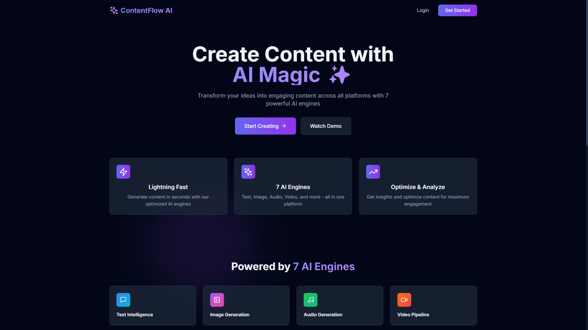

### Login & Register
<p align="center">
  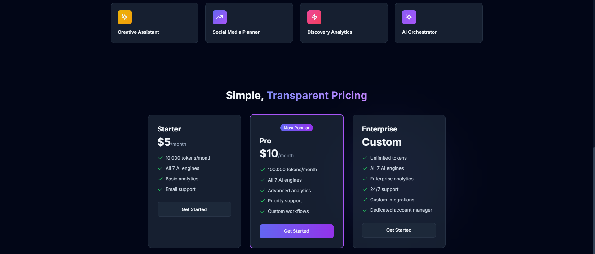
  &nbsp;
  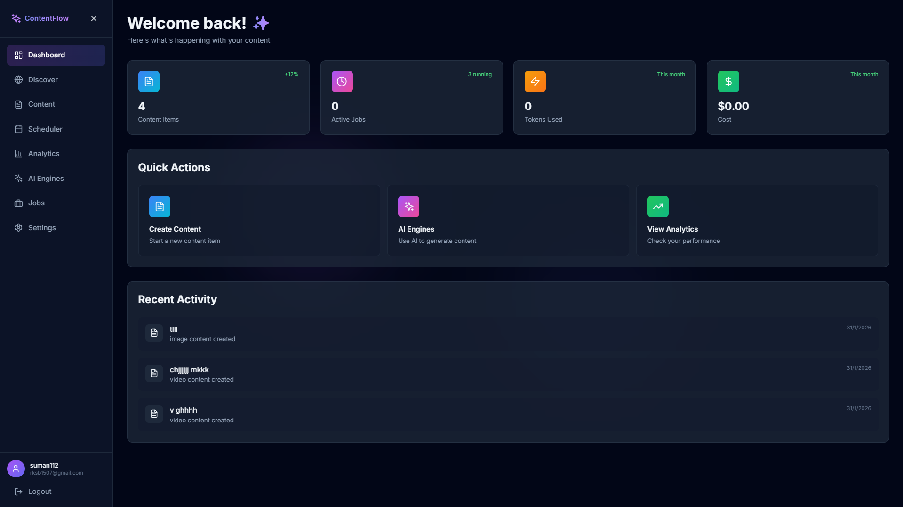
</p>

### Dashboard
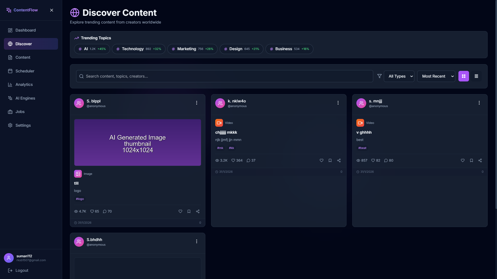

### Content Management
<p align="center">
  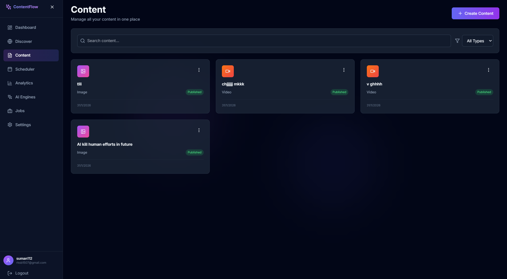
  &nbsp;
  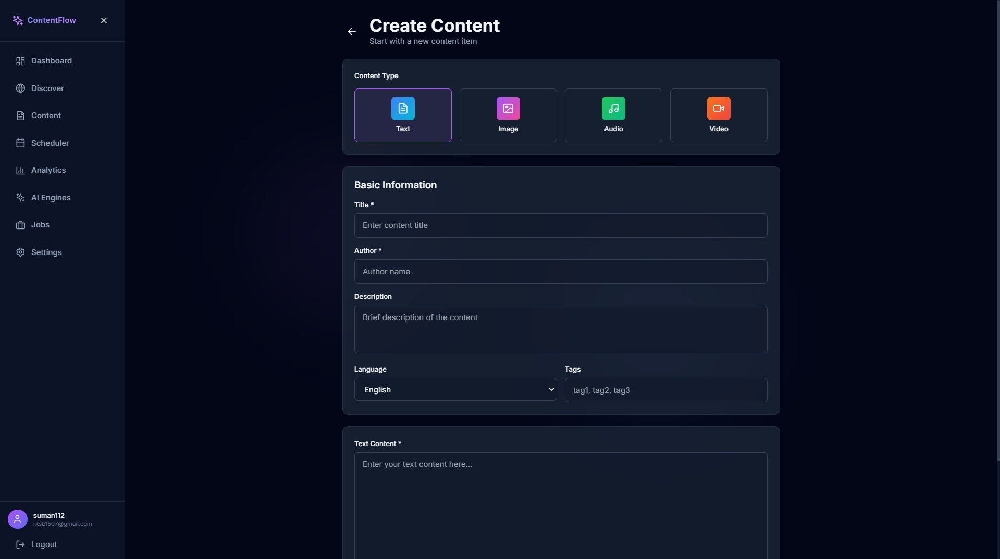
</p>

### AI Engines
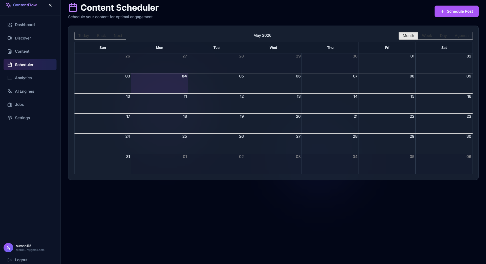

### Analytics
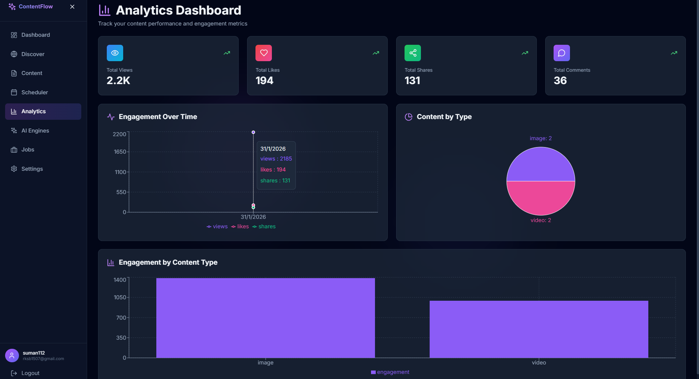

### Job Processing
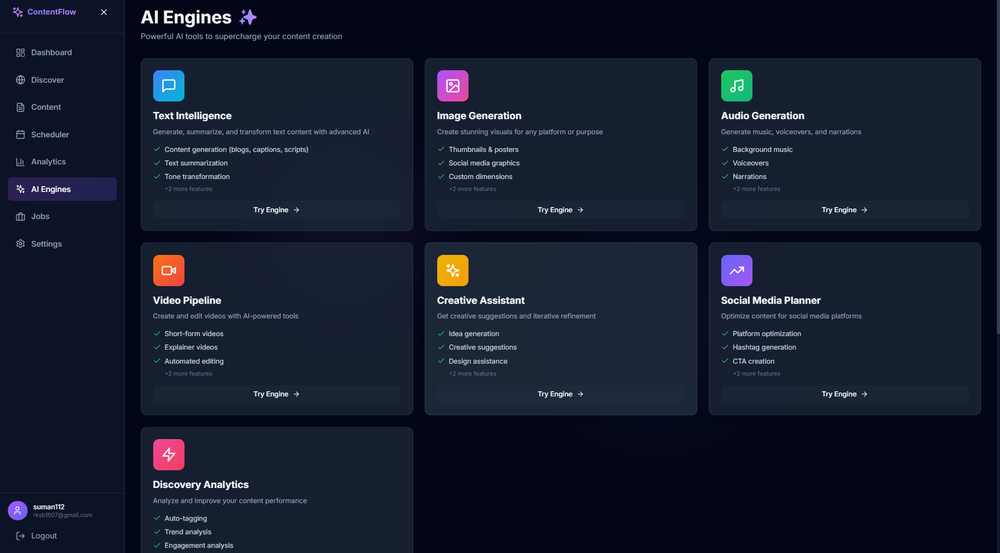

### Content Scheduler
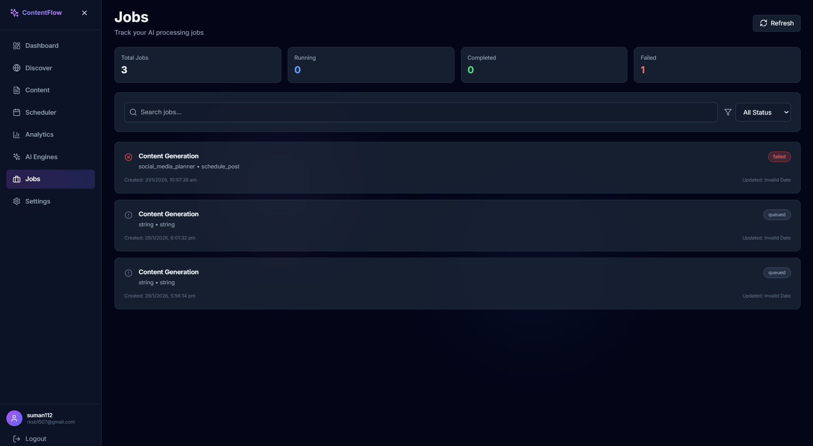

### Settings
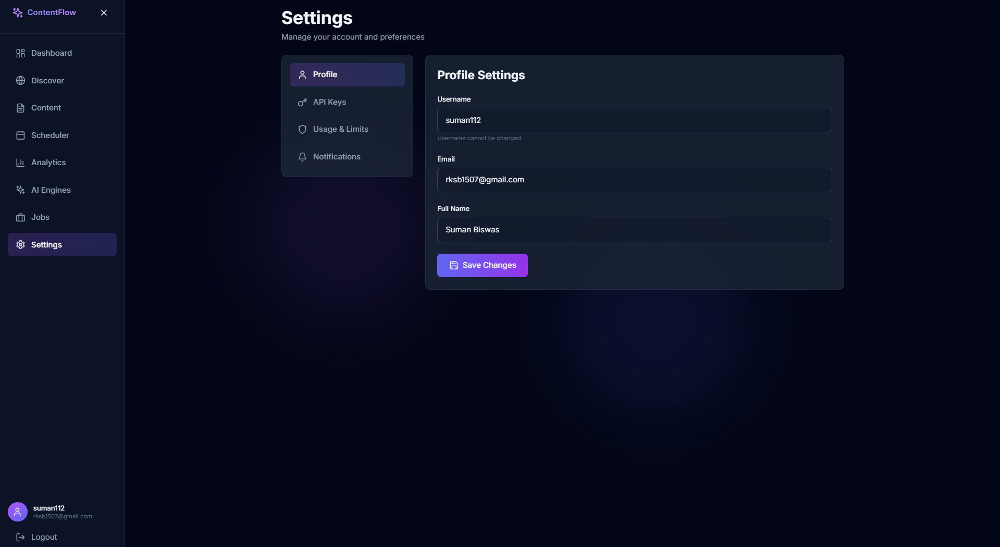

---

## 🏗️ Architecture

ContentFlow AI follows a modern microservices-inspired architecture:

```
┌─────────────────────────────────────────────────────────────┐
│                     Frontend (React + TypeScript)            │
│  ┌──────────┐  ┌──────────┐  ┌──────────┐  ┌──────────┐   │
│  │Dashboard │  │ Engines  │  │ Content  │  │Analytics │   │
│  └──────────┘  └──────────┘  └──────────┘  └──────────┘   │
└────────────────────────┬────────────────────────────────────┘
                         │ REST API
┌────────────────────────┴────────────────────────────────────┐
│                   Backend (FastAPI + Python)                 │
│  ┌──────────────────────────────────────────────────────┐  │
│  │              API Layer (FastAPI)                      │  │
│  │  ┌─────────┐  ┌─────────┐  ┌─────────┐  ┌─────────┐ │  │
│  │  │  Auth   │  │ Content │  │  Jobs   │  │ Engines │ │  │
│  │  └─────────┘  └─────────┘  └─────────┘  └─────────┘ │  │
│  └──────────────────────────────────────────────────────┘  │
│  ┌──────────────────────────────────────────────────────┐  │
│  │           AI Orchestration Layer                      │  │
│  │  ┌──────────────────────────────────────────────┐    │  │
│  │  │  AI Orchestrator (Gemini-powered)            │    │  │
│  │  └──────────────────────────────────────────────┘    │  │
│  └──────────────────────────────────────────────────────┘  │
│  ┌──────────────────────────────────────────────────────┐  │
│  │              AI Engines Layer                         │  │
│  │  ┌────────┐ ┌────────┐ ┌────────┐ ┌────────┐        │  │
│  │  │  Text  │ │ Image  │ │ Audio  │ │ Video  │  ...   │  │
│  │  └────────┘ └────────┘ └────────┘ └────────┘        │  │
│  └──────────────────────────────────────────────────────┘  │
│  ┌──────────────────────────────────────────────────────┐  │
│  │           Services Layer                              │  │
│  │  ┌─────────┐ ┌─────────┐ ┌─────────┐ ┌─────────┐   │  │
│  │  │  Jobs   │ │  Auth   │ │  Cost   │ │Versioning│  │  │
│  │  └─────────┘ └─────────┘ └─────────┘ └─────────┘   │  │
│  └──────────────────────────────────────────────────────┘  │
└────────────────────────┬────────────────────────────────────┘
                         │
┌────────────────────────┴────────────────────────────────────┐
│                   Data Layer (MongoDB)                       │
│  ┌──────────┐  ┌──────────┐  ┌──────────┐  ┌──────────┐   │
│  │  Users   │  │ Content  │  │   Jobs   │  │Workflows │   │
│  └──────────┘  └──────────┘  └──────────┘  └──────────┘   │
└─────────────────────────────────────────────────────────────┘
```

## 🛠️ Tech Stack

### Backend
- **Framework**: FastAPI 0.104+
- **Language**: Python 3.11+
- **AI/ML**: Google Gemini AI
- **Database**: MongoDB 7+
- **Authentication**: JWT (JSON Web Tokens)
- **Async Processing**: AsyncIO, Motor
- **Testing**: Pytest
- **API Documentation**: OpenAPI/Swagger

### Frontend
- **Framework**: React 18+
- **Language**: TypeScript 5+
- **Build Tool**: Vite
- **Styling**: Tailwind CSS
- **UI Components**: Headless UI, Lucide Icons
- **Animations**: Framer Motion
- **State Management**: Zustand
- **HTTP Client**: Axios
- **Routing**: React Router v6

### Infrastructure
- **Containerization**: Docker
- **Orchestration**: Docker Compose
- **Storage**: Local file system (images, audio, video)
- **Logging**: Structured JSON logging

## 🚀 Getting Started

### Prerequisites

- Python 3.11 or higher
- Node.js 18 or higher
- MongoDB 7 or higher
- Google Gemini API key

### Installation

1. **Clone the repository**
```bash
git clone https://github.com/yourusername/contentflow-ai.git
cd contentflow-ai
```

2. **Set up environment variables**
```bash
cp .env.example .env
```

Edit `.env` and add your configuration:
```env
# Google Gemini API
GOOGLE_API_KEY=your_gemini_api_key_here

# MongoDB
MONGODB_URL=mongodb://localhost:27017
DATABASE_NAME=contentflow_ai

# Security
SECRET_KEY=your_secret_key_here
ALGORITHM=HS256
ACCESS_TOKEN_EXPIRE_MINUTES=30

# Server
HOST=0.0.0.0
PORT=8000
```

3. **Install backend dependencies**
```bash
pip install -r requirements.txt
```

4. **Install frontend dependencies**
```bash
cd frontend
npm install
cd ..
```

5. **Start MongoDB**
```bash
# Using Docker
docker-compose up -d mongodb

# Or start your local MongoDB instance
mongod
```

6. **Start the backend server**
```bash
uvicorn app.main:app --reload --host 0.0.0.0 --port 8000
```

7. **Start the frontend development server**
```bash
cd frontend
npm run dev
```

8. **Access the application**
- Frontend: http://localhost:3000
- Backend API: http://localhost:8000
- API Documentation: http://localhost:8000/docs

### Quick Start with Docker

```bash
# Build and start all services
docker-compose up -d

# View logs
docker-compose logs -f

# Stop all services
docker-compose down
```

## 🤖 AI Engines

### Text Intelligence Engine
```python
# Example usage
from app.ai.text_intelligence_engine import TextIntelligenceEngine

engine = TextIntelligenceEngine()
result = await engine.generate_text(
    prompt="Write a blog post about AI",
    max_tokens=500,
    temperature=0.7
)
```

### Creative Assistant Engine
```python
# Example usage
from app.ai.creative_assistant_engine import CreativeAssistantEngine

engine = CreativeAssistantEngine()
session = await engine.start_session(
    session_type="ideation",
    topic="Product Launch",
    brand_voice="professional"
)
suggestions = await engine.get_suggestions(session.session_id)
```

### Image Generation Engine
```python
# Example usage
from app.ai.image_generation_engine import ImageGenerationEngine

engine = ImageGenerationEngine()
result = await engine.generate_image(
    prompt="A futuristic cityscape at sunset",
    style="photorealistic",
    aspect_ratio="16:9"
)
```

## 📚 API Documentation

### Authentication

All API endpoints (except public ones) require authentication using JWT tokens.

```bash
# Register a new user
curl -X POST http://localhost:8000/api/v1/auth/register \
  -H "Content-Type: application/json" \
  -d '{"username": "user", "email": "user@example.com", "password": "password123"}'

# Login
curl -X POST http://localhost:8000/api/v1/auth/login \
  -H "Content-Type: application/json" \
  -d '{"email": "user@example.com", "password": "password123"}'
```

### Content Endpoints

```bash
# Create content
curl -X POST http://localhost:8000/api/v1/content/ \
  -H "Authorization: Bearer YOUR_TOKEN" \
  -H "Content-Type: application/json" \
  -d '{"title": "My Content", "type": "text", "content": "Hello World"}'

# Get all content
curl -X GET http://localhost:8000/api/v1/content/ \
  -H "Authorization: Bearer YOUR_TOKEN"

# Update content
curl -X PUT http://localhost:8000/api/v1/content/{content_id} \
  -H "Authorization: Bearer YOUR_TOKEN" \
  -H "Content-Type: application/json" \
  -d '{"title": "Updated Title"}'

# Delete content
curl -X DELETE http://localhost:8000/api/v1/content/{content_id} \
  -H "Authorization: Bearer YOUR_TOKEN"
```

### AI Engine Endpoints

```bash
# Text generation
curl -X POST http://localhost:8000/api/v1/engines/text/generate \
  -H "Authorization: Bearer YOUR_TOKEN" \
  -H "Content-Type: application/json" \
  -d '{"prompt": "Write a story", "max_tokens": 500}'

# Image generation
curl -X POST http://localhost:8000/api/v1/engines/image/generate \
  -H "Authorization: Bearer YOUR_TOKEN" \
  -H "Content-Type: application/json" \
  -d '{"prompt": "A beautiful landscape", "style": "photorealistic"}'
```

For complete API documentation, visit: http://localhost:8000/docs

## 📁 Project Structure

```
contentflow-ai/
├── app/                          # Backend application
│   ├── ai/                       # AI engines
│   │   ├── orchestrator.py       # AI orchestration layer
│   │   ├── text_intelligence_engine.py
│   │   ├── creative_assistant_engine.py
│   │   ├── image_generation_engine.py
│   │   ├── audio_generation_engine.py
│   │   ├── video_pipeline_engine.py
│   │   ├── social_media_planner.py
│   │   └── discovery_analytics_engine.py
│   ├── api/                      # API endpoints
│   │   ├── v1/
│   │   │   ├── endpoints/
│   │   │   │   ├── auth.py
│   │   │   │   ├── content.py
│   │   │   │   ├── engines.py
│   │   │   │   ├── jobs.py
│   │   │   │   └── orchestrator.py
│   │   │   └── api.py
│   │   └── middleware/
│   ├── core/                     # Core functionality
│   │   ├── config.py
│   │   ├── database.py
│   │   ├── exceptions.py
│   │   └── logging.py
│   ├── models/                   # Data models
│   │   ├── base.py
│   │   ├── content.py
│   │   ├── jobs.py
│   │   └── users.py
│   ├── services/                 # Business logic
│   │   ├── auth_service.py
│   │   ├── job_processor.py
│   │   ├── content_versioning.py
│   │   └── cost_tracking.py
│   ├── utils/                    # Utilities
│   │   ├── security.py
│   │   └── validators.py
│   └── main.py                   # Application entry point
├── frontend/                     # Frontend application
│   ├── src/
│   │   ├── components/           # Reusable components
│   │   ├── pages/                # Page components
│   │   │   ├── Dashboard.tsx
│   │   │   ├── ContentList.tsx
│   │   │   ├── AIEngines.tsx
│   │   │   ├── Analytics.tsx
│   │   │   └── engines/          # Individual engine pages
│   │   ├── lib/                  # Utilities
│   │   │   ├── api.ts
│   │   │   └── mediaUtils.ts
│   │   ├── store/                # State management
│   │   └── App.tsx
│   ├── public/
│   └── package.json
├── tests/                        # Test suite
│   ├── test_orchestrator.py
│   ├── test_engines.py
│   └── conftest.py
├── storage/                      # File storage
│   ├── images/
│   ├── audio/
│   └── videos/
├── .env                          # Environment variables
├── .env.example                  # Environment template
├── docker-compose.yml            # Docker configuration
├── Dockerfile                    # Docker image
├── requirements.txt              # Python dependencies
├── pytest.ini                    # Pytest configuration
└── README.md                     # This file
```

## ⚙️ Configuration

### Environment Variables

| Variable | Description | Default |
|----------|-------------|---------|
| `GOOGLE_API_KEY` | Google Gemini API key | Required |
| `MONGODB_URL` | MongoDB connection string | `mongodb://localhost:27017` |
| `DATABASE_NAME` | Database name | `contentflow_ai` |
| `SECRET_KEY` | JWT secret key | Required |
| `ALGORITHM` | JWT algorithm | `HS256` |
| `ACCESS_TOKEN_EXPIRE_MINUTES` | Token expiration | `30` |
| `HOST` | Server host | `0.0.0.0` |
| `PORT` | Server port | `8000` |
| `RATE_LIMIT_PER_MINUTE` | API rate limit | `60` |

### MongoDB Collections

- `users` - User accounts and authentication
- `content_items` - Content storage
- `async_jobs` - Job queue and history
- `workflow_executions` - Workflow tracking
- `cost_tracking` - Usage and cost data

## 💻 Development

### Running Tests

```bash
# Run all tests
pytest

# Run with coverage
pytest --cov=app --cov-report=html

# Run specific test file
pytest tests/test_orchestrator.py

# Run with verbose output
pytest -v
```

### Code Quality

```bash
# Format code
black app/

# Lint code
flake8 app/

# Type checking
mypy app/
```

### Frontend Development

```bash
cd frontend

# Run development server
npm run dev

# Build for production
npm run build

# Preview production build
npm run preview

# Lint
npm run lint
```

## 🚢 Deployment

### Production Build

1. **Build frontend**
```bash
cd frontend
npm run build
```

2. **Configure production environment**
```bash
cp .env.example .env.production
# Edit .env.production with production values
```

3. **Deploy with Docker**
```bash
docker-compose -f docker-compose.prod.yml up -d
```

### Environment-Specific Configuration

- Development: `.env`
- Production: `.env.production`
- Testing: `.env.test`

## 🤝 Contributing

We welcome contributions! Please follow these steps:

1. Fork the repository
2. Create a feature branch (`git checkout -b feature/amazing-feature`)
3. Commit your changes (`git commit -m 'Add amazing feature'`)
4. Push to the branch (`git push origin feature/amazing-feature`)
5. Open a Pull Request

### Coding Standards

- Follow PEP 8 for Python code
- Use TypeScript for frontend code
- Write tests for new features
- Update documentation as needed
- Use meaningful commit messages

## 📄 License

This project is licensed under the MIT License - see the [LICENSE](LICENSE) file for details.

## 🙏 Acknowledgments

- Google Gemini AI for powering the AI engines
- FastAPI for the excellent web framework
- React team for the frontend framework
- MongoDB for the database
- All open-source contributors

## 📞 Support

- **Documentation**: [Full Documentation](https://docs.contentflow-ai.com)
- **Issues**: [GitHub Issues](https://github.com/sumanbiswas15/contentflow-ai/issues)
- **Email**: rksb1507@gmail.com
- **Discord**: [Join our community](https://discord.gg/contentflow-ai)

## 🗺️ Roadmap

- [ ] Multi-language support
- [ ] Advanced analytics dashboard
- [ ] Real-time collaboration
- [ ] Plugin system for custom engines
- [ ] Mobile applications
- [ ] Enterprise features
- [ ] Advanced workflow automation
- [ ] Integration with popular platforms

---

**Built with ❤️ by the ContentFlow AI Team**

*Transform your content creation workflow with AI-powered intelligence.*
